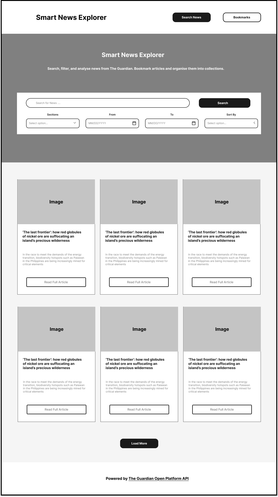
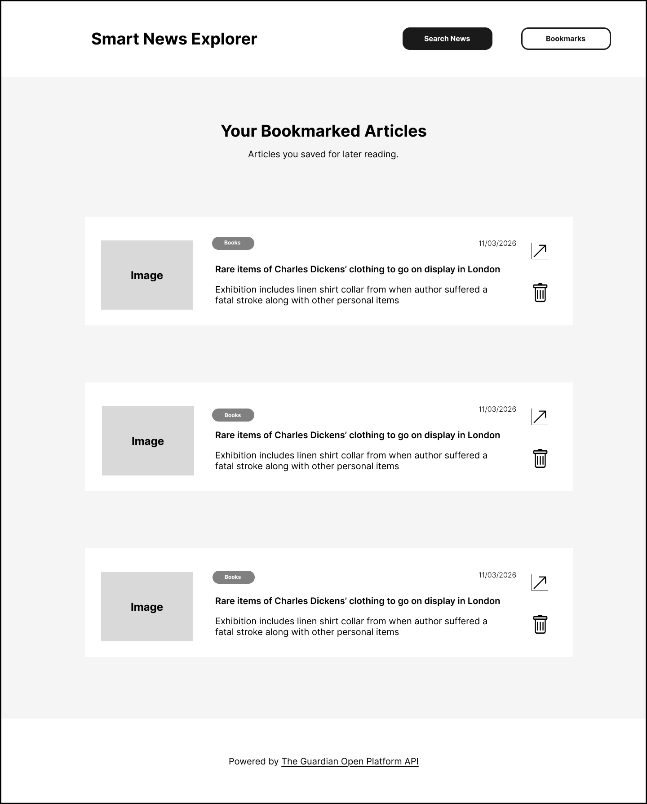
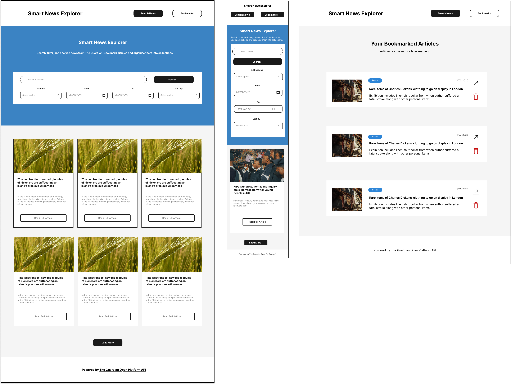
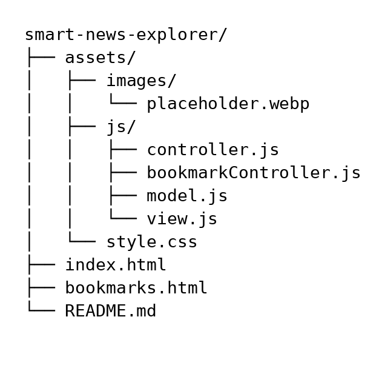

# Smart News Explorer

Smart News Explorer is a web application that allows users to search, filter, and explore news articles using **The Guardian Open Platform API**. Users can filter articles by section, date range, and sorting order, and bookmark articles for later reading.

The application is built using **Vanilla JavaScript with an MVC architecture**, ensuring a clear separation between data handling, application logic, and UI rendering.

---

## Wireframes

Wireframes were created in Figma before development began, to plan the layout, structure, and navigation of the application. The wireframes cover three views: desktop, mobile, and the bookmarks page.

### Desktop — Search Page

The desktop layout places the hero section and search bar front and centre. This was a deliberate UX decision — the primary purpose of the application is to search for news, so the search input is the first thing a user sees. The navigation bar provides quick access to the Bookmarks page from anywhere in the app. Article results are displayed in a three-column card grid below the search section, making good use of the available screen space.

### Mobile — Search Page

On mobile, the layout adapts to a single-column view. The filter controls stack vertically beneath the search input so they remain usable on smaller screens. Article cards display one per row. The navbar simplifies to a centred brand name with navigation buttons, keeping the interface clean and usable on touch devices.

### Bookmarks Page

The bookmarks page uses a horizontal list layout rather than a card grid, as this is more appropriate for a saved articles view where users want to scan titles quickly. Each bookmark displays the article thumbnail, section badge, title, trail text, date, a link to the full article, and a remove button. An empty state message is shown when no bookmarks have been saved.

### Design Decisions

- The hero section uses a blue gradient background to create a clear visual separation between the search/filter area and the article results below.
- Bootstrap was chosen as the CSS framework to ensure consistent, responsive styling across all screen sizes without extensive custom CSS.
- The bookmark button is positioned in the top-right corner of each article card so it is accessible without interfering with the article content.
- A placeholder image is used when an article does not include a thumbnail, ensuring cards maintain a consistent layout regardless of the API response.

### Design Mockup

The following mockup shows the final design across all three views before development began, including colour scheme, typography and layout.

## Live Demo

https://fahim2023.github.io/smart-news-explorer/

---

## Features

- Search news articles using The Guardian API
- Filter by section (politics, sport, world news, etc.)
- Filter by date range
- Sort by:
  - Newest
  - Oldest
  - Relevance
- Pagination with **Load More**
- Bookmark articles for later reading
- View bookmarked articles on a separate page
- LocalStorage used for bookmark persistence
- Fallback image if article thumbnail is missing
- Fully responsive layout using Bootstrap

---

## Tech Stack

### Frontend

- HTML5
- CSS3
- Bootstrap 5
- Vanilla JavaScript (ES Modules)

### Architecture

- MVC (Model View Controller)

### API

- The Guardian Open Platform API

### Storage

- Browser LocalStorage

## Project Structure

## Architecture (MVC)

The application follows an **MVC structure**.

### Model

Handles API requests and data logic.

`model.js`

Responsibilities:

- Fetch articles from The Guardian API
- Build query parameters
- Return structured article data

---

### View

Responsible for rendering UI components.

`view.js`

Responsibilities:

- Render article cards
- Render bookmarked articles
- Update pagination buttons
- Populate sections dropdown

---

### Controller

Handles user interaction and application flow.

`controller.js`

Responsibilities:

- Load articles on page load
- Handle search submissions
- Handle section filtering
- Handle sorting
- Handle pagination

---

### Bookmark Controller

Handles bookmark logic and LocalStorage.

`bookmarkController.js`

Responsibilities:

- Save bookmarks
- Remove bookmarks
- Render saved bookmarks

---

## API

This project uses:

**The Guardian Open Platform API**

https://open-platform.theguardian.com/

Example endpoint:

https://content.guardianapis.com/search

Query parameters used:

- `q`
- `section`
- `from-date`
- `to-date`
- `order-by`
- `page`
- `page-size`
- `show-fields`

## Future Improvements

- Backend to hide API key
- Article collections (multiple bookmark groups)
- Dark mode
- Article preview modal
- Search suggestions

## Author

Fahim Adam

## Acknowledgements

The MVC architecture pattern used in this project was inspired by
[Jonas Schmedtmann's](https://github.com/jonasschmedtmann) Forkify project,
part of his [JavaScript course](https://www.udemy.com/course/the-complete-javascript-course/) on Udemy.

## License

This project is for educational purposes.
