## Testing Strategy

Testing for this project was carried out throughout development and again after deployment to ensure the live version matched the development version.

The project was tested using:

- Manual testing of all user-facing features
- Responsive testing across different screen sizes
- Validation testing for empty and invalid user input
- Browser testing to check compatibility
- Code validation using HTML, CSS and JavaScript validation tools

Testing focused on functionality, usability, responsiveness, and error handling.

## User Story Testing

| User Story                                                                 | Expected Outcome                                   | Result | Evidence                                   |
| -------------------------------------------------------------------------- | -------------------------------------------------- | ------ | ------------------------------------------ |
| As a user, I want to view the latest articles so that I can stay informed. | Latest articles are displayed when the page loads. | Pass   | Screenshot: home page with loaded articles |

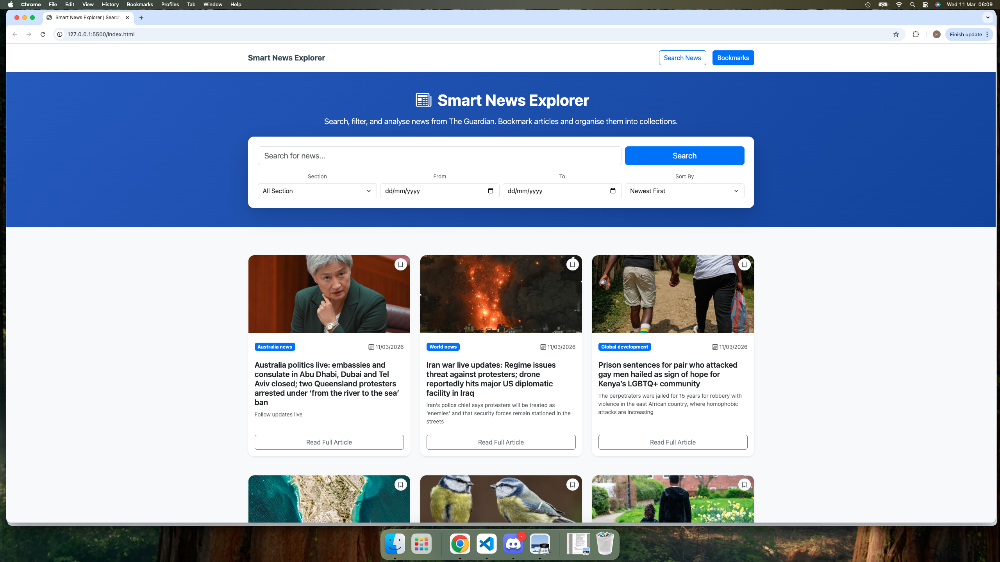

| User Story                                                                            | Expected Outcome                                              | Result | Evidence                               |
| ------------------------------------------------------------------------------------- | ------------------------------------------------------------- | ------ | -------------------------------------- |
| As a user, I want to search for articles by keyword so that I can find relevant news. | Matching articles are displayed after entering a search term. | Pass   | Screenshot: search results for "vapes" |

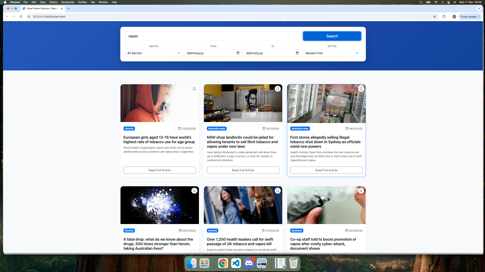

| User Story                                                                               | Expected Outcome                                                 | Result | Evidence                       |
| ---------------------------------------------------------------------------------------- | ---------------------------------------------------------------- | ------ | ------------------------------ |
| As a user, I want feedback when no results are found so that I understand what happened. | A clear message is shown when no matching articles are returned. | Fail   | Screenshot: no results message |

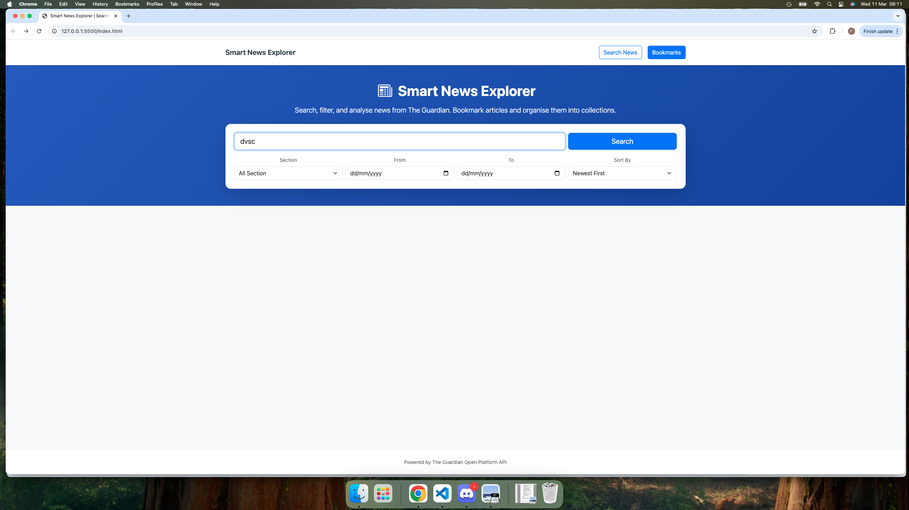

| User Story                                                                       | Expected Outcome                                          | Result | Evidence                        |
| -------------------------------------------------------------------------------- | --------------------------------------------------------- | ------ | ------------------------------- |
| As a user, I want to save articles for later so that I can return to them later. | Selected articles are stored and shown in saved articles. | Pass   | Screenshot: saved articles page |

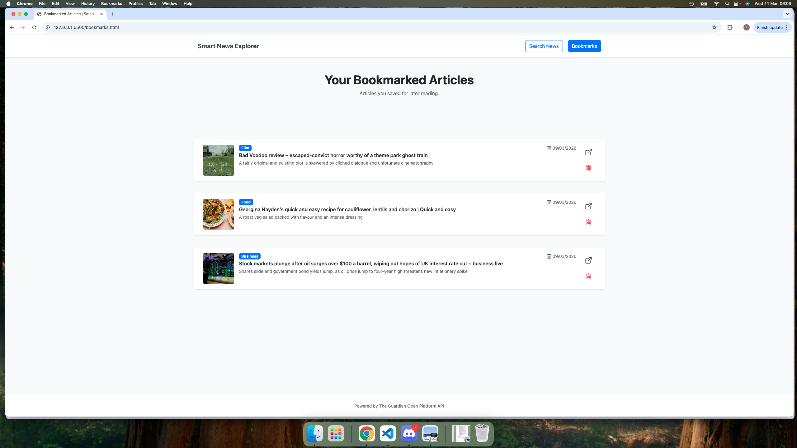

| User Story                                                                            | Expected Outcome                                | Result | Evidence                |
| ------------------------------------------------------------------------------------- | ----------------------------------------------- | ------ | ----------------------- |
| As a user, I want the site to work on mobile so that I can use it on smaller screens. | Layout adapts correctly on mobile screen sizes. | Pass   | Screenshot: mobile view |

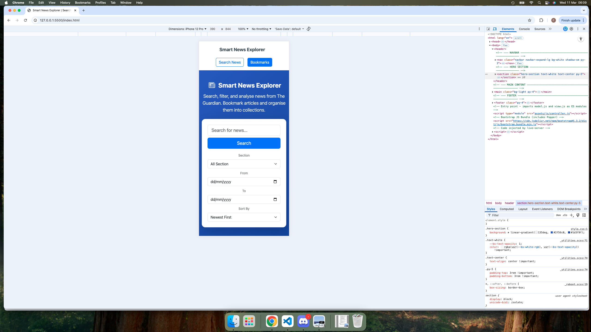
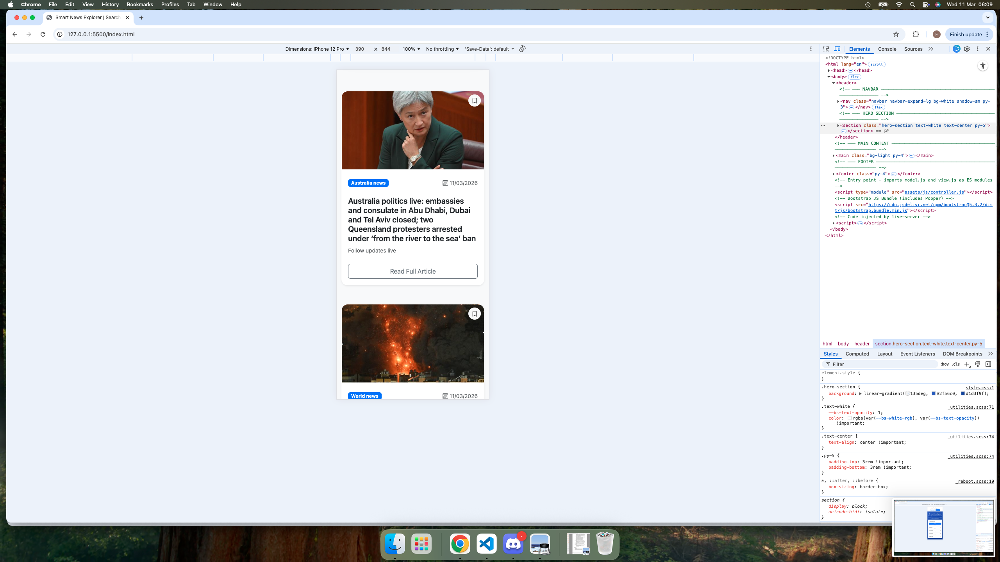

## Bugs and Fixes

### Fixed Bugs

1. **Issue:** Search with an empty input submitted a request anyway.  
   **Cause:** No validation was in place before calling the API.  
   **Fix:** Added a check to stop submission if the input is empty and display a user-friendly error message.  
   **Status:** Fixed.

   ```javascript
   state.query = searchInput.value.trim();
   if (!state.query) {
     DefaultView.showError("Please enter a search term.");
     return;
   }
   ```

2. **Issue:** Layout broke when labels were added to the date picker section.  
   **Cause:** Existing layout classes did not account for extra label spacing.  
   **Fix:** Adjusted container spacing and alignment styles.  
   **Status:** Fixed.

3. **Issue:** Deployed app behaved differently from local version.  
   **Cause:** `config.js` was in `.gitignore` and never pushed to GitHub, causing the API key import to fail.  
   **Fix:** Moved the API key directly into `model.js` and removed the `config.js` dependency.  
   **Status:** Fixed.

4. **Issue:** Bookmark icon disappeared when hovering over a card.  
   **Cause:** The card image scaling on hover overlapped the bookmark button in the stacking context.  
   **Fix:** Added `z-index: 10` to `.bookmark-btn` in `style.css` to keep the button on top.  
   **Status:** Fixed.

5. **Issue:** Articles duplicated on initial page load.  
   **Cause:** `loadArticles()` was being called twice on `DOMContentLoaded`.  
   **Fix:** Removed the duplicate call, leaving a single `await loadArticles()` at the end of the initialisation block.  
   **Status:** Fixed.

6. **Issue:** Duplicate articles could be added to bookmarks.  
   **Cause:** The bookmark feature saved the article to localStorage without checking if it already existed.  
   **Fix:** Added a check before saving to ensure the article is not already stored in bookmarks.  
   **Status:** Fixed.

   ```javascript
   const exists = bookmarks.some((article) => article.id === newArticle.id);
   if (!exists) {
     bookmarks.push(newArticle);
   }
   ```

7. **Issue:** Duplicate bookmark cards appeared after deleting a bookmark.  
   **Cause:** The `renderBookmarks()` function re-rendered the updated list without first clearing the existing container contents, causing remaining bookmarks to be appended to already rendered cards.  
   **Fix:** The bookmarks container is now cleared with `container.innerHTML = ""` before rendering the updated list.  
   **Status:** Fixed.

   ```javascript
   renderBookmarks(bookmarks) {
     const container = document.getElementById("bookmarksResults");
     container.innerHTML = "";
     bookmarks.forEach(bookmark => {
       // render bookmark card
     });
   }
   ```

8. **Issue:** Searching for an invalid or unrecognised query returned no feedback to the user.  
   **Cause:** No check was in place to handle an empty results array returned by the API.  
   **Fix:** Added a check in `loadArticles()` to display a user-friendly error message and hide the Load More button when the API returns zero results.  
   **Status:** Fixed.
   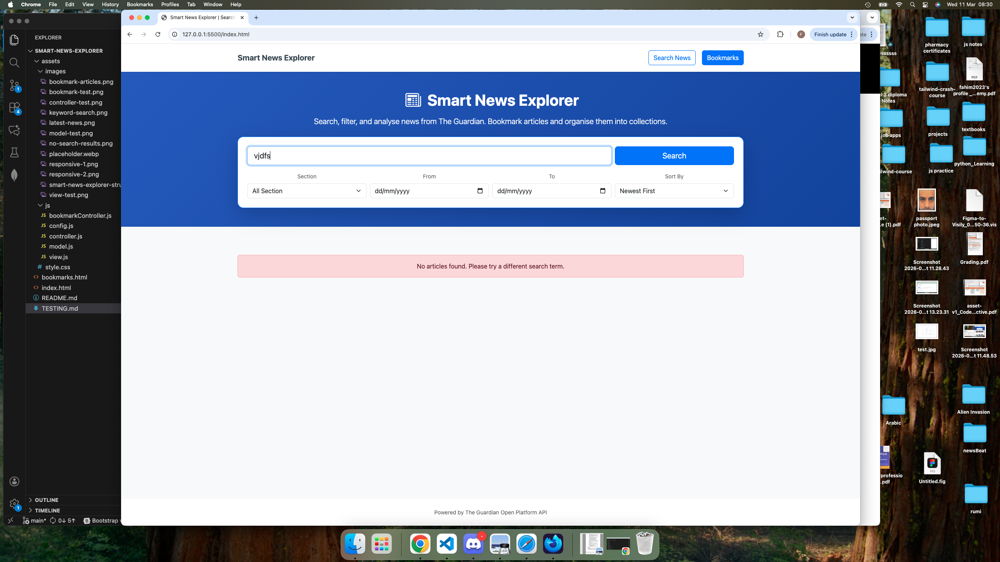

```javascript
if (data.results.length === 0) {
  DefaultView.showError(
    "No articles found. Please try a different search term.",
  );
  DefaultView.updateLoadMoreBtn(0, 0);
  return;
}
```

---

### Unfixed Bugs

- **Issue:** Some article thumbnails are missing for certain API results.  
  **Cause:** The Guardian API does not always return image data for every article.  
  **Impact:** Affected cards display a placeholder image instead of the article thumbnail.  
  **Status:** Partially mitigated — a fallback placeholder image is shown, but the root cause is outside the control of this application as it depends on the external API.

## Validation

### HTML

HTML was tested using the W3C Markup Validation Service.  
Result: No major errors remaining after fixes.
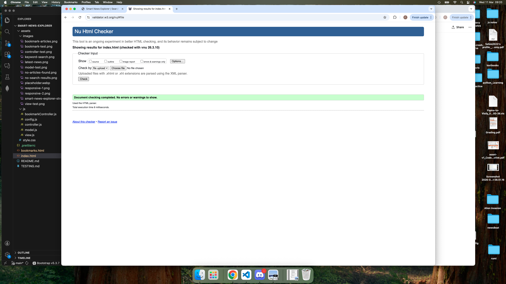
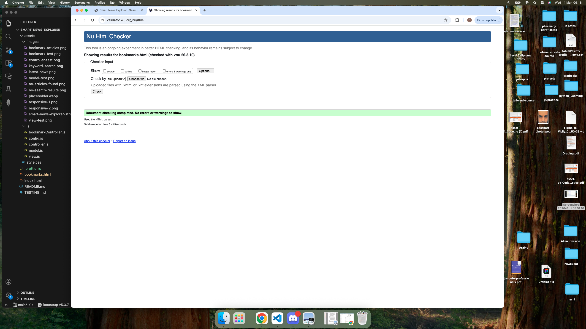

### CSS

CSS was tested using the W3C Jigsaw Validator.  
Result: No major errors remaining after fixes.


### JavaScript

JavaScript was checked using a linter - jshint.  
Result: No major issues affecting functionality remained after fixes.

## JavaScript Validation

JavaScript files were validated using **JSHint**. Each file was tested individually by copying the source code into the validator.

As the project uses modern JavaScript features including ES Modules (`import` / `export`), `const`, template literals, and `async/await`, JSHint was configured with:

```javascript
/* jshint esversion: 11 */
```

After validation, only a small number of warnings were reported, primarily related to JSHint's limited handling of ES module syntax rather than genuine errors. No major issues affecting functionality were identified.

### Validation Results

**view.js**

- One warning: `Export declarations are only allowed at the top level of module scope`
- Related to JSHint's handling of ES module syntax, does not affect functionality.
  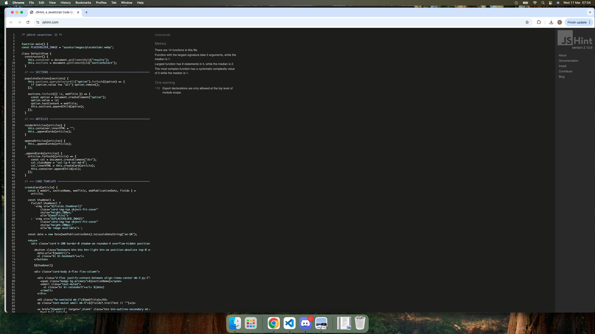

**model.js**

- Four warnings reported:
  - `Import declarations are only allowed at the top level of module scope`
  - `Export declarations are only allowed at the top level of module scope`
  - `'PAGE_SIZE' is defined but never used`
- The module syntax warnings are caused by JSHint's support limitations for ES modules. The `PAGE_SIZE` variable was removed as it was declared but never referenced in the code.

  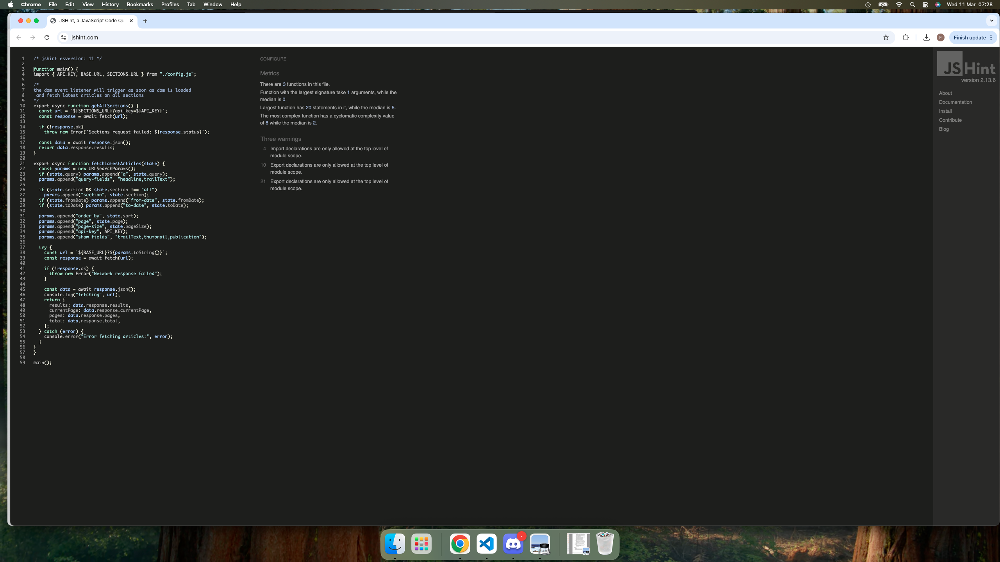

**controller.js**

- Three warnings reported:
  - `Import declarations are only allowed at the top level of module scope`
  - `'searchBtn' is defined but never used`
- The module syntax warning relates to ES module handling. The `searchBtn` variable was removed as it was selected from the DOM but never used in the application logic.

  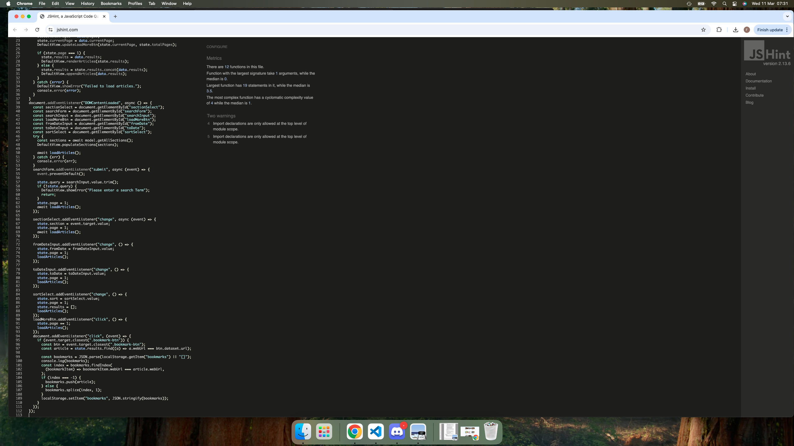

  **bookmarkController.js**

- One warning: `Import declarations are only allowed at the top level of module scope`
- Related to ES module syntax handling, does not affect behaviour.

  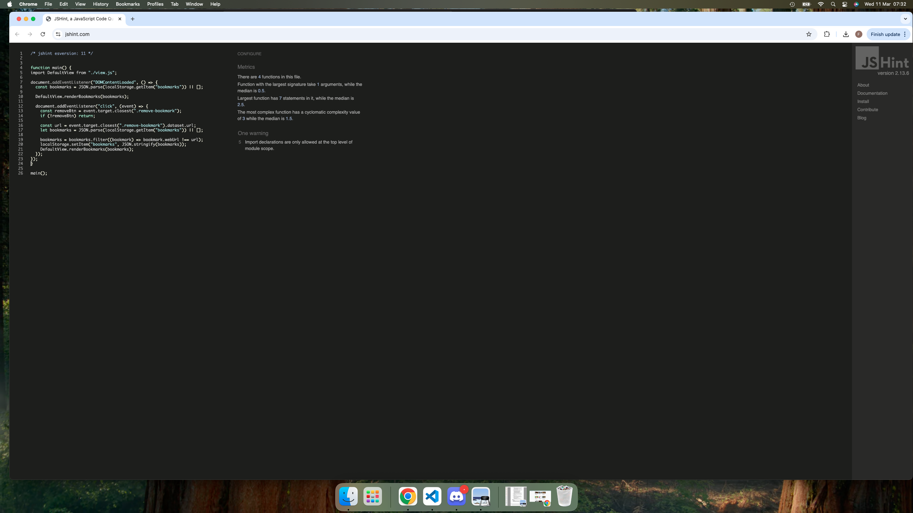

### Conclusion

JSHint confirmed no major JavaScript issues affecting functionality. Two unused variables (`PAGE_SIZE` and `searchBtn`) were identified and removed during the validation process. All remaining warnings relate to tool limitations with modern ES module syntax. The application runs without errors in the browser console during normal user interaction.

## Compatibility Testing

The project was tested in the following environments:

- Google Chrome
- Safari
- Firefox Developer Edition
- Mobile view using browser developer tools

The site remained functional and responsive across the tested environments.
